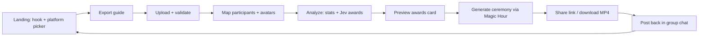

# 01 — Product brief

**Working title:** Wrapped for your group chat  
**One-liner:** Upload your group chat export → get friend awards + a shareable AI awards ceremony video.

---

## Problem

Group chats are where modern friendships live—inside jokes, drama arcs, 2 a.m. voice-note energy, and years of chaos. Nobody has a fun, shareable artifact that *celebrates* that history the way Spotify Wrapped celebrates listening.

People already screenshot stats, run informal “who texts most” polls, and use third-party analyzers—but nothing combines **roasty awards**, **everyone in the group**, and a **ceremony moment** worth posting back into the chat.

## Target users

| Segment | Why they care | Acquisition hook |
|--------|----------------|------------------|
| **College / early-career friend groups** (5–15 people) | High banter, ritual sharing, low stigma around roasting | TikTok/Reels, “send this to the group chat” |
| **Long-running group chats** (2+ years) | Enough signal for funny awards | Nostalgia + “we need to do this” |
| **Trip / wedding / league chats** | Temporary intensity → perfect recap moment | Event-triggered shares |
| **Power user / organizer** | One person exports and drives the experience | “I made us a Wrapped” clout |

**Primary persona:** *The Organizer* — exports the chat, uploads, maps names, picks photos, shares the link. Everyone else is a viewer/participant who may need to consent to likeness.

**Non-goals at MVP:** corporate Slack analytics, legal e-discovery, dating-app DMs, public celebrity chat scraping.

## Core loop

1. **Land** on a single promise: “Your group chat, but it’s an awards show.”
2. **Export** with platform-specific instructions (in-app).
3. **Upload** file(s); we detect format and parse.
4. **Identify** members (display names from export → confirm real names / photos).
5. **Analyze** deterministic metrics + Jev judging for subjective awards.
6. **Preview** awards (static share card + ceremony script).
7. **Render** async ceremony video.
8. **Share** public or unlisted link + download; optional OG image for iMessage preview.

**Session shape (assumption):** one upload → one “Wrapped” artifact. Re-upload to refresh stats is v2.

## Why it’s shareable / viral

| Mechanic | Effect |
|----------|--------|
| **Social proof inside the group** | Everyone is named; FOMO if you’re not in the export |
| **Roast + love** | Awards are funny, not HR-safe corporate |
| **Ceremony format** | Video is inherently repostable (Stories, TikTok, Discord) |
| **Taggable winners** | “@you won Biggest Ghoster” drives replies |
| **Low effort for viewers** | Link opens instantly; no app install required |
| **Seasonal cadence** | “Year in chat” positioning (even if chat isn’t calendar-bound) |

**Viral loop:** Organizer uploads → shares preview in chat → members open link → share clip of *their* award → new groups see watermark / “make yours” CTA.

## MVP scope vs. later

### MVP (v0.1)

| In scope | Out of scope |
|----------|----------------|
| Web app, mobile-friendly upload | Native iOS/Android apps |
| **WhatsApp** `.txt` / export ZIP (`_chat.txt`) | Live WhatsApp API |
| **Telegram** single-chat `result.json` (JSON export) | Full-account Telegram export UX |
| **Facebook Messenger** DYI JSON (`messages/inbox/...`) | Instagram DMs (separate export path—see below) |
| 5–20 participants, 1k–80k messages sweet spot | Billion-message archives without sampling UI |
| 15–18 awards (mix stats + Jev) | User-authored custom awards |
| Participant mapping + optional photo per person | Auto face-pull from all media (legal risk) |
| Static results page + share card | Full social graph / leaderboards across users |
| Magic Hour ceremony (~45–90s vertical video) | User-editable video timeline |
| Email magic link or anonymous session + paywall TBD | Full accounts with chat library |

### Platform support research & MVP recommendation

| Platform | Official export? | Typical artifact | Media in export | Size / limits | Naming | Locale / date quirks | MVP? |
|----------|----------------|------------------|-----------------|---------------|--------|----------------------|------|
| **WhatsApp** | Yes (mobile) | `.txt` or ZIP with `_chat.txt` + optional media folders | Optional (“with/without media”) | No hard public cap; large groups → 10–50MB+ txt common; ZIP can be **hundreds of MB** with media | Display names as shown in chat; phone-number senders possible | iOS `[DD/MM/YYYY, HH:MM:SS]` vs Android `DD/MM/YYYY, HH:MM -`; US vs EU date order; 12h/24h; RTL marks | **Yes — P0** |
| **Telegram** | Yes (Desktop) | `result.json` (+ optional `photos/`, etc.) | Optional | JSON can be **very large** for old supergroups; HTML often heavier | `from` + `from_id`; group title in root `name` | `date_unixtime` is authoritative UTC; `text` may be array for entities; **public channels may only include your messages** | **Yes — P0** (JSON only) |
| **Messenger** | Yes (Facebook DYI) | `messages/inbox/<thread>/message_N.json` | Optional in parallel folders | Facebook packs async; multi-GB possible if media included | `sender_name` (often legal name); `participants` array | `timestamp_ms`; messages **newest-first** per file; **10k msgs/file** split | **Yes — P1** (JSON only, no media required) |
| **Discord** | **No** native bulk export | Third-party: DiscordChatExporter JSON, browser extensions | Attachments paths in JSON | Large servers impractical; DMs feasible | `author.name`, nicknames, IDs | ISO timestamps; reactions & embeds rich | **P2 — “Bring JSON”** with docs for DiscordChatExporter; ToS/self-scrape risk called out in privacy doc |
| **iMessage** | **No** consumer export | Third-party: iMazing TXT/CSV, `imessage-exporter` on Mac | Via backup tools | Requires Mac/backup access | Phone numbers / contact names | Heterogeneous TXT layouts | **Post-MVP** unless we partner on one canonical format |
| **Instagram DMs** | Partial via Meta DYI | Often under **Instagram** export, not Messenger-only | Media heavy | Same DYI pipeline, different folder | Instagram handles | Same JSON family as Meta | **P2** after Messenger parser reuse |

**Recommendation:** Ship **WhatsApp + Telegram JSON** first (highest “group chat Wrapped” intent, clearest parsers). Add **Messenger JSON** next (reuse Meta JSON patterns). **Discord** as advanced upload with explicit “you exported this yourself” disclaimer. **Defer iMessage** until we standardize on one third-party export template.

**Upload limits (assumption for MVP):** max **150 MB** per upload; **without media** encouraged in UI copy; parser streams line-by-line for WhatsApp.

### Later (v1+)

- Discord official-adjacent flows (exporter CLI recipe in-product)
- iMessage via guided `imessage-exporter` output
- Instagram DMs
- Custom awards, inside-joke awards (user text → moderated)
- Team plans / brand wraps
- Re-run annually, diff year-over-year
- Audio voice cloning for host (only with explicit consent)

## Name options

| # | Name | Vibe |
|---|------|------|
| 1 | **Chatty Awards** | Obvious, ceremony-forward |
| 2 | **GC Wrapped** | Spotify-adjacent, dev-friendly |
| 3 | **The Groupies** | Playful; check trademark |
| 4 | **Read Receipts** | Roast energy, tech pun |
| 5 | **Main Character Minutes** | Gen-Z, points at time-in-chat awards |

**Assumption:** avoid “WhatsApp Wrapped” in the product name (platform trademark).

## Business model (assumption)

| Model | Pros | Cons |
|-------|------|------|
| **$4.99 one-time per ceremony** | Simple, giftable | Friction before wow moment |
| **Free preview + $7.99 HD video** | Viral preview | Partial spoil |
| **$9.99/mo unlimited** | Power users | Overkill for annual use |

Default assumption for unit economics doc: **free award preview + paid HD ceremony** (see `08-roadmap-and-risks.md` when written).

## Success metrics

| Metric | MVP target (assumption) | Notes |
|--------|-------------------------|-------|
| **Upload → preview completion** | ≥ 55% | Drop-off at export friction |
| **Preview → paid ceremony** | ≥ 12% | Depends on price |
| **Share rate** (link copied or MP4 downloaded) | ≥ 40% of completions | Core viral KPI |
| **Median time to preview** | < 90s for 30k msgs | Parsing + Jev batch |
| **NPS / “would do another chat”** | ≥ 50 | Qual in early beta |
| **Safety** | < 0.5% moderation escalations | Roast boundary |

## Competitive landscape (light)

- Chat stat sites / WhatsApp analyzers: stats only, no ceremony, often desktop-ish UX.
- Generic “AI year recap” apps: not group-native, no export fidelity.
- **Differentiation:** export-native, group awards catalog, Magic Hour ceremony, share loop.

## Principles

1. **Roast, don’t harm** — no mental health, body, sexuality, trauma, or protected-class targeting (see `03-awards-system.md`).
2. **Uploader ≠ owner of others’ data** — consent flows are product-critical (`06-data-and-privacy.md`).
3. **Delete raw exports fast** — trust as a feature.
4. **Jev for judgment, code for math** — predictable, cheap, typed.

---

## Assumptions & open questions

| # | Assumption / question | Impact if wrong |
|---|------------------------|-----------------|
| 1 | **Assumption:** Organizer-led upload is acceptable without per-member pre-consent for *text analysis* if we disclose + offer opt-out/removal before public share. | Legal review required before launch |
| 2 | **Assumption:** MVP monetizes on ceremony render, not preview. | Changes funnel UX |
| 3 | **Open:** Minimum group size (suggest **≥ 3** active members, **≥ 500** messages)? | Edge-case awards quality |
| 4 | **Open:** Support WhatsApp **with media** at MVP or actively block ZIP >50MB? | Parser + storage cost |
| 5 | **Open:** Brand positioning vs Spotify “Wrapped” — seasonal marketing only? | Trademark / marketing |
| 6 | **Open:** English-only copy at MVP? | Parser still multi-locale; UI i18n later |
| 7 | **Confirmed dependency:** Jev does **not** generate award prose—only typed decisions; copy comes from templates (`03-awards-system.md`). | Copy quality strategy |
