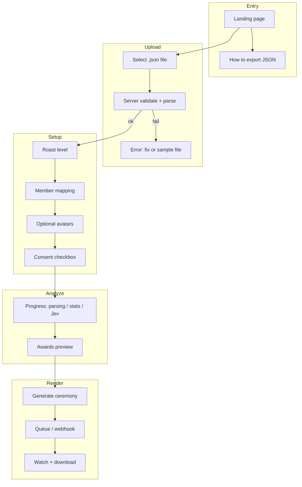

# 02 — User flows

End-to-end journeys for **Kudos AI** demo MVP: landing → JSON upload → awards → ceremony → share.

---

## Flow overview



---

## 1. Landing

**Goal:** One CTA—“Upload your group chat (JSON).”

| Element | Copy (example) |
|---------|----------------|
| Headline | “Your group chat deserves a standing ovation.” |
| Sub | “Upload a JSON export. Get awards. Get a ceremony. Drop it back in the chat.” |
| Primary CTA | Upload JSON |
| Secondary | “How do I get JSON?” → export hub |
| Trust | “Free demo · Raw file deleted after analysis · You control sharing” |

**Sample file:** `sample-apartment-4b.json` (synthetic, 6 members, ~800 msgs) for instant try.

---

## 2. Export instructions (in-app)

Users may arrive without JSON. Hub pages per platform—all paths output **JSON** for upload.

### Telegram

1. Install **Telegram Desktop** (mobile export is limited).
2. Open the group → `⋯` → **Export chat history**.
3. Format: **JSON** (not HTML).
4. Optional: toggle off large media folders if file is huge.
5. Upload the folder’s **`result.json`** (single-chat export).

**Quirks:** Use `date_unixtime` internally. `text` may be string or array—adapter normalizes. Public channels may only include *your* messages.

### Facebook Messenger (Meta DYI)

1. [Download Your Information](https://www.facebook.com/dyi/) → **JSON** → select **Messages** only.
2. Wait for email; unzip.
3. Navigate to `messages/inbox/<conversation_folder>/`.
4. Upload **`message_1.json`** (demo: single file). If thread spans `message_2.json`, merge in v2 or use Kudos converter CLI.

**Quirks:** `timestamp_ms`; messages often **newest-first** per file; `sender_name` may be legal name.

### Discord

**No official export.** Document two options:

| Method | Steps | Risk |
|--------|-------|------|
| **DiscordChatExporter** | Desktop CLI/GUI → export channel/DM → **JSON** | User must comply with Discord ToS; read-only token |
| **Browser extension** (e.g. discord-export) | Export JSON from logged-in session | Same |

Copy: “Only export chats you’re in. Kudos AI doesn’t connect to Discord.”

### WhatsApp

No native JSON. Demo options:

1. Use Telegram/Messenger for internal dogfood.
2. Run documented **txt → Kudos JSON** converter (post-MVP script in repo).
3. Paste minimal Kudos JSON template for hackathons.

### Kudos Chat JSON v1

Power users / scripts: see [07-api-and-data-model.md](./07-api-and-data-model.md#kudos-chat-json-v1).

---

## 3. Upload validation & security

**Threat model:** untrusted JSON from the internet (malicious uploader, compromised export tool, “joke” files).

### Client-side (soft checks)

- Extension must be `.json`.
- Size warning if >25 MB.

### Server-side (hard gates)

| Check | Limit / rule |
|-------|----------------|
| Max upload size | **50 MB** |
| Parse | `JSON.parse` with **reviver** rejecting `__proto__`, `constructor`, `prototype` keys |
| Max depth | **32** nested levels |
| Max object keys (per object) | **10,000** |
| Max array length | **500,000** (messages array) |
| Max string length | **10,000** chars per field (truncate message `text` with audit flag) |
| Max distinct senders | **100** |
| Charset | Valid UTF-8; strip null bytes |
| Content | Strip HTML tags from message bodies; reject if `text` contains `<script` (case-insensitive) |
| Rate limit | **5 uploads / hour / IP** (demo); **3 ceremonies / day / IP** |
| Time | Parse timeout **30s** CPU |

**Not in demo MVP:** embedded base64 media blobs (reject if `attachments[].data` base64 >1MB).

### Adapter detection

```
1. If root.kudos_version → Kudos v1
2. Else if root.messages[].from_id + date_unixtime → Telegram
3. Else if root.messages[].sender_name + timestamp_ms → Messenger
4. Else if root.messages[].author.name → DiscordChatExporter
5. Else if root.messages[] with sender + timestamp → generic heuristic
6. Else → 400 with link to schema + sample file
```

### Error UX

| Code | User message |
|------|----------------|
| `FILE_TOO_LARGE` | “This JSON is over 50MB. Export without media or split the chat.” |
| `UNSUPPORTED_SHAPE` | “We couldn’t read this JSON. Try our sample or the Kudos format guide.” |
| `MALICIOUS_CONTENT` | “This file failed safety checks. Remove scripts/HTML and try again.” |
| `TOO_MANY_MESSAGES` | “Over 500k messages—pick a shorter date range and re-export.” |

---

## 4. Member identification & mapping

After normalize:

| Step | UI |
|------|-----|
| Auto-list members | Derived from distinct senders; show message count |
| Merge duplicates | “Sam” vs “Sam Lee” → manual merge (select two → one) |
| Display name | Editable label for ceremony (default export name) |
| Exclude | Toggle “Remove from awards” (e.g. bot, ex-member) |
| Min members | Warn if <3; block if <2 |

**IDs:** Internal `memberId` stable hash of normalized export id or `name+rank`.

---

## 5. Avatars & likeness

| Source | Demo MVP |
|--------|----------|
| User-uploaded photo per member | **Yes** — JPEG/PNG, max 2MB, face optional |
| Pull from chat export media | **No** (consent + moderation) |
| Default | Initials on gradient |

**Flow:** Grid of members → “Add photo” → crop square → stored in object storage with session TTL.

---

## 6. Consent & sharing

Before **public** share link or ceremony render:

```
☐ I confirm I have permission to upload this chat and share awards about 
  these people, or I have removed members who haven't agreed.
☐ I understand Kudos AI will process message text with AI (Jev) and a 
  video provider (Magic Hour).
```

**Non-consenting members:**

| Action | Behavior |
|--------|----------|
| Removed in mapping | Excluded from awards and ceremony |
| Left in chat but uploader unsure | Show “Request kudos” placeholder award skip |
| Opt-out link (v2) | Email/hash link to remove self from published page |

**Demo:** consent checkbox required; no legal opt-out portal yet.

---

## 7. Analysis progress

| Phase | UI copy | Duration (typical) |
|-------|---------|-------------------|
| Parsing | “Reading your chaos…” | 2–15s |
| Stats | “Counting texts, links, and 2am messages…” | 5–30s |
| Jev | “Deliberating with the judges…” | 1–5s |
| Copy | “Writing acceptance speeches…” | <1s |

Show roast level reminder. Allow cancel → discard session.

---

## 8. Awards preview

- Carousel or grid of 18 cards.
- Each: title, winner, 1 receipt, 1 line (tone from roast dial).
- **Regenerate** (demo): re-run Jev only (same stats), max 2 times.
- CTA: **Generate ceremony** (free).

---

## 9. Ceremony generation & delivery

1. User clicks Generate → job enqueued.
2. UI: “Rolling the red carpet…” with % from webhook/poll.
3. Complete: inline player (9:16), **Download MP4**, **Copy link**.
4. Link: `kudos.ai/s/{slug}` — `noindex` meta, unlisted slug (unguessable).

**Failure:** static fallback page (see [04](./04-ceremony-generation.md)).

---

## 10. Share-back loop

Suggested share copy:

> “We ran our group chat through Kudos AI. I’m allegedly the Funniest. Your turn: [link]”

OG tags: group title + “Kudos AI Awards”; preview image = composite award card (not video on first paint).

---

## Assumptions & open questions

| # | Item |
|---|------|
| 1 | **Assumption:** Single JSON file per session at demo; Messenger multi-file merge is v2. |
| 2 | **Assumption:** Session identified by cookie + server id; no account required. |
| 3 | **Open:** Show raw message quotes on award cards or receipts-only for privacy. |
| 4 | **Open:** Watermark “Made with Kudos AI” on free demo video (recommended yes). |
