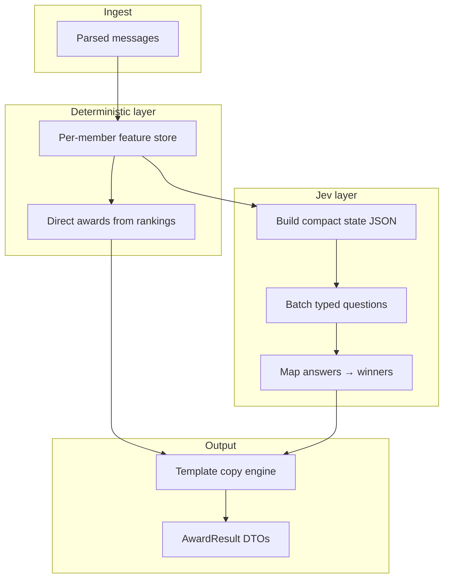

# 03 — Awards system

How we turn parsed chat messages into **15–20 roasty friend awards**, mixing **deterministic stats** with **Jev** for subjective calls.

---

## Design principles

| Principle | Implementation |
|-----------|----------------|
| **Funny > accurate** | Stats are real; framing is comedic |
| **Roast, never cruel** | Blocklisted topics; no punching down |
| **One primary winner per award** | Optional runner-up in UI only |
| **Explainability** | Every award shows 1–2 “receipt” bullets (counts, dates, examples) |
| **Jev judges; code measures** | Jev returns `choice` / `score` / `noul` only—no free-form text ([Jev API](https://jevtypesafeai.com/jev/api)) |
| **Copy is templated** | Presentation strings selected in code from pools keyed by winner + stats |

### Tone guidelines

**Do:** hyperbole, group in-joke energy, behavioral patterns (“always sends the link”), affectionate drag.

**Don’t:** mental health diagnoses, eating/body comments, racism/sexism/homophobia, cheating accusations as fact, outing someone, mocking grief/crisis messages, sexual content involving minors.

**Moderation hooks (MVP):** keyword blocklist on exemplar quotes; suppress awards if thread contains crisis keywords; human review queue if user reports.

### Roast dial (user setting)

Set once per session before analysis:

| Level | Jev + templates | Example line tone |
|-------|-----------------|-------------------|
| **gentle** | Softer `instructions`; gentle template pool | “Alex sends the most messages—we appreciate the commitment.” |
| **medium** | Default | “Alex treats the chat like a group project they’re carrying alone.” |
| **spicy** | Edgier templates; still blocklisted topics | “Alex’s notifications could be classified as a natural disaster.” |

Implementation: `meta.roast_level` in Jev state + `roast_copy_variant` `choice` where needed (`gentle` \| `medium` \| `spicy`).

---

## Jev integration (facts from docs)

| Topic | Detail |
|-------|--------|
| **Endpoint (production)** | `POST https://api.typesafe.ai/v1/systemone` (TypeSafe direct, pinned model) |
| **Endpoint (dev optional)** | `POST https://jevtypesafeai.com/api/v1/decide` (hosted gateway) |
| **Primitives** | `choice` (≤255 options), `score` (ordered scale), `noul` (0–1 probability) |
| **Context** | ~**64k tokens** state + all questions; ~**32k** state + longest single question; overflow → `max_tokens_exceeded` (no silent truncate) |
| **Output** | Typed JSON per question; **no generated prose** |
| **Cost (hosted)** | ~**$0.42 / 1M input tokens**; output free; ~**$0.001/decision** order-of-magnitude |
| **Latency** | ~70–500ms per call (docs) |
| **Rate limits** | 250k tokens/s, 1200 req/min (hosted docs) |
| **Versioning** | Pin `jev-1.13.0` (or current stable) in production |
| **Training** | TypeSafe [Privacy Policy](https://typesafe.ai/legal/privacy-policy): will **not** train on Input; **ZDR** enterprise via sales@typesafe.ai |
| **Implication** | Award **titles** are fixed catalog; **winner** + **variant** via Jev `choice`; **intensity** via `score`/`noul`; **roast lines** from template tables |

Optional: TypeSafe **`POST /api/v1/context/filter`** to trim long per-member digests before judging (documented shortcut).

---

## Pipeline overview



1. **Normalize** messages → `Message { id, ts, authorId, text, reactions?, replyTo?, attachments? }`.
2. **Compute features** per `MemberId` (and pairwise).
3. **Assign deterministic awards** where ranking is unambiguous.
4. **Build Jev state** (~summaries + exemplars, under token budget).
5. **Run Jev** in batched `decide` calls (many questions per call).
6. **Resolve conflicts** (one person shouldn’t sweep 8 awards—see tie-breaking).
7. **Render copy** from templates + receipts.

---

## Feature store (computed in code)

| Feature | Definition | Notes |
|---------|------------|-------|
| `msg_count` | Messages sent | Exclude system events |
| `char_count` / `word_count` | Volume | |
| `active_days` | Distinct calendar days with ≥1 msg | Timezone = export metadata or user-selected |
| `median_response_sec` | Median time to first reply *to* their messages | Only threads where someone replies within 7d |
| `ghost_score` | % of their @mentions or direct questions with no reply within 4h | Min sample 20 |
| `initiation_rate` | % of sessions they sent first message after 4h gap | |
| `late_night_share` | % msgs local hour 00:00–04:59 | |
| `early_bird_share` | % msgs 05:00–08:59 | |
| `link_count` | URLs sent | |
| `media_count` | Images/video/sticker placeholders | Platform-dependent |
| `reaction_received` | Sum reactions on their messages | Discord/Telegram; WA limited |
| `laugh_proxy` | Count of `lol`, `lmao`, `😂`, `💀`, `haha` *in messages they caused* (replies within 5 min) | Heuristic |
| `drama_proxy` | Threads with reply count ≥8 in 30 min where they sent ≥3 | |
| `caps_lock_rate` | % msgs with >60% caps | |
| `double_text_score` | Messages within 60s same author | |
| `edit_count` | Edited messages | Platform-dependent |
| `mention_count` | @mentions | |
| `emoji_density` | Emojis per 100 chars | |

Store rolling **exemplar lists** (max 5 per category per member): shortest/longest message, top laugh replies, sample link, latest late-night msg. **Never send full chat to Jev.**

---

## Award catalog (18 awards)

| ID | Award name | Primary signal | Layer | Min data |
|----|------------|----------------|-------|----------|
| `most_messages` | **The Human Notification** | `msg_count` max | Code | 7d chat, ≥200 msgs total |
| `least_messages` | **Ghost of the Year** | `msg_count` min (active member) | Code | same |
| `fastest_replier` | **Speed-Reply Demon** | `median_response_sec` min | Code | ≥30 reply samples |
| `slowest_replier` | **Seen-zoned** | `median_response_sec` max | Code | same |
| `late_night_texter` | **After Hours CEO** | `late_night_share` max | Code | ≥50 msgs |
| `early_bird` | **Alarm Clock Energy** | `early_bird_share` max | Code | same |
| `link_lord` | **Link Dealer** | `link_count` max | Code | ≥10 links group-wide |
| `double_texter` | **Bubble Assault** | `double_text_score` max | Code | — |
| `caps_champion` | **CAPS LOCK ENTHUSIAST** | `caps_lock_rate` max | Code | ≥20 msgs |
| `emoji_overload` | **Emoji Tax Evader** | `emoji_density` max | Code | — |
| `meme_dealer` | **Meme Supplier** | `media_count` + image placeholders | Code / Jev tie | media signal |
| `funniest` | **Funniest (Allegedly)** | `laugh_proxy` + Jev on exemplars | **Jev** + code shortlist | top 3 by laugh_proxy |
| `hype_person` | **Hype Man / Woman / Them** | reactions + positive replies | Code / Jev | reactions if available |
| `drama_starter` | **Main Character Energy** | `drama_proxy` + Jev | **Jev** + code shortlist | ≥2 drama threads |
| `peacemaker` | **The “Guys Chill”** | de-escalation noul + calm replies | **Jev** | exemplars |
| `planner` | **Trip Admin** | logistics keywords + polls | **Jev** `choice` | exemplars |
| `chaos_gremlin` | **Chaos Gremlin** | unpredictable topic shifts | **Jev** `score` | member digests |
| `heart_of_group` | **Group Chat Glue** | bridges subcliques / replies many members | **Jev** + graph stats | ≥4 members |

**Inactive member rule:** members with `< 2%` of messages and `< 20` msgs are excluded from *negative* awards (ghost, seen-zoned) unless user toggles “include lurkers.”

---

## Deterministic awards (examples)

### Sample receipt copy (templates)

**The Human Notification** — *Alex*  
- Receipt: `4,812 messages (34% of the chat)`  
- Line: “Your phone keyboard has a personal vendetta against silence.”

**Ghost of the Year** — *Jordan*  
- Receipt: `41 messages in 14 months`  
- Line: “You’re in the chat the way a plant is in a office—technically present.”

### Tie-breaking (code)

1. If tied on primary metric → secondary metric (e.g. `msg_count` tie → higher `word_count`).
2. If still tied → **earliest** `memberId` lexicographic (deterministic) **unless** Jev award → re-run with narrowed `choice` criteria (two-member only).
3. **Winner diversity (confirmed):** after all awards assigned, if one member holds **>4** awards, reassign lowest-confidence Jev awards to runner-up until ≤4 (deterministic awards reassigned by lowest margin on primary metric).

---

## Jev layer

### State payload shape (TypeScript-ish)

Sent as JSON `state` (not raw chat):

```json
{
  "meta": {
    "platform": "whatsapp",
    "member_count": 6,
    "message_count": 28410,
    "date_range": { "start": "2023-01-04", "end": "2025-09-30" },
    "tone": "roasty_friend_awards"
  },
  "members": [
    {
      "id": "m_alex",
      "display_name": "Alex",
      "stats": {
        "msg_count": 4812,
        "late_night_share": 0.22,
        "laugh_proxy": 890,
        "drama_proxy": 7
      },
      "exemplars": {
        "funny": [
          { "ts": "2024-11-02T01:14:00", "text": "bro nobody asked for a TED talk" },
          { "ts": "2025-03-18T22:03:00", "text": "i'm crying this is the worst idea you've had since bangs" }
        ],
        "drama": [
          { "ts": "2024-07-04T19:22:00", "text": "wait WHY would you invite him" }
        ],
        "wholesome": [
          { "ts": "2025-01-01T00:01:00", "text": "proud of you all fr" }
        ]
      }
    }
  ],
  "shortlists": {
    "funniest_candidates": ["m_alex", "m_sam", "m_riley"],
    "drama_candidates": ["m_sam", "m_riley"],
    "peacemaker_candidates": ["m_jordan", "m_alex"]
  },
  "group_exemplars": {
    "planning": [
      { "author": "m_jordan", "text": "ok vote: fri or sat, and pick a budget" }
    ]
  }
}
```

**Token budget:** target **≤ 20k tokens** state per call; exemplar text truncated to **160 chars** each.

### Question batch: subjective awards

Single `decide` call (pin `model`: `jev-1.13.0`):

```json
{
  "model": "jev-1.13.0",
  "state": { "...": "..." },
  "questions": {
    "funniest_winner": {
      "type": "choice",
      "instructions": "Who is funniest in a friendly roast sense, based on exemplars and laugh_proxy stats? Pick exactly one member id.",
      "criteria": {
        "m_alex": "Alex — high laugh reactions, witty replies in exemplars",
        "m_sam": "Sam — dry humor, deadpan",
        "m_riley": "Riley — chaotic punchlines"
      }
    },
    "funniest_confidence_gate": {
      "type": "noul",
      "instructions": "Is there a clear funniest winner (not a 3-way tie in quality)?"
    },
    "drama_starter_winner": {
      "type": "choice",
      "instructions": "Who most often escalates or starts conflict threads (playful roast, not moral judgment)?",
      "criteria": {
        "m_sam": "Sam",
        "m_riley": "Riley"
      }
    },
    "peacemaker_winner": {
      "type": "choice",
      "instructions": "Who de-escalates, changes subject constructively, or supports others?",
      "criteria": {
        "m_jordan": "Jordan",
        "m_alex": "Alex"
      }
    },
    "planner_winner": {
      "type": "choice",
      "instructions": "Who organizes meetups, polls, logistics?",
      "criteria": {
        "m_jordan": "Jordan",
        "m_riley": "Riley",
        "m_alex": "Alex"
      }
    },
    "chaos_gremlin": {
      "type": "choice",
      "instructions": "Who introduces random tangents and unpredictable energy?",
      "criteria": {
        "m_riley": "Riley",
        "m_sam": "Sam",
        "m_alex": "Alex"
      }
    },
    "heart_of_group": {
      "type": "choice",
      "instructions": "Who keeps the most members engaged (replies across cliques)?",
      "criteria": {
        "m_alex": "Alex",
        "m_jordan": "Jordan",
        "m_sam": "Sam"
      }
    },
    "meme_dealer_winner": {
      "type": "choice",
      "instructions": "If stats are ambiguous, who supplies memes/images that match group humor?",
      "criteria": {
        "m_sam": "Sam",
        "m_riley": "Riley"
      }
    }
  }
}
```

### Example response (illustrative)

```json
{
  "model": "jev-1.13.0",
  "answers": {
    "funniest_winner": {
      "type": "choice",
      "choice": "m_alex",
      "confidence": 0.81,
      "probabilities": { "m_alex": 0.81, "m_sam": 0.12, "m_riley": 0.07 }
    },
    "funniest_confidence_gate": { "type": "noul", "noul": 0.88 },
    "drama_starter_winner": {
      "type": "choice",
      "choice": "m_sam",
      "confidence": 0.74
    }
  },
  "usage": { "input_tokens": 12400, "cost_usd": 0.0052 }
}
```

### Mapping answers → `AwardResult`

```typescript
type AwardResult = {
  awardId: string;
  winnerMemberId: string;
  runnerUpMemberId?: string;
  source: "code" | "jev";
  jev?: {
    questionId: string;
    confidence?: number;
    probabilities?: Record<string, number>;
  };
  receipts: string[];      // human bullets
  presentationLine: string; // from template engine
  exemplarQuote?: string;   // optional, moderated
};
```

**Low confidence:** if `funniest_confidence_gate.noul < 0.55`, use code-only winner (`max laugh_proxy`) and softer copy (“Too close to call, but the numbers say…”).

### Roast copy without Jev prose

Template table keyed by `(awardId, variant)` where `variant` = `choice` from a **style** question OR hash of stats bucket:

```json
{
  "funniest": {
    "default": [
      "{name} won because the chat treats their messages like a sitcom laugh track.",
      "Statistically speaking, {name} is 43% of why everyone has ‘typing…’ PTSD."
    ],
    "close_call": [
      "{name} edged it out—honorable mention to the entire group’s comedic disorder."
    ]
  }
}
```

Optional second Jev call for **variant only** (cheap):

```json
{
  "questions": {
    "funniest_copy_variant": {
      "type": "choice",
      "instructions": "Pick roast tone variant: gentle, medium, spicy (still kind).",
      "criteria": { "gentle": "soft tease", "medium": "standard roast", "spicy": "edgy but not cruel" }
    }
  }
}
```

---

## Large chats (100k+ messages)

Jev cannot ingest 100k messages (~64k token cap). Strategy:

| Stage | Action |
|-------|--------|
| 1. **Full pass in code** | Compute all features on complete dataset (streaming parser, O(n) aggregations). |
| 2. **Time stratification** | Per member: histogram by month; pick top 3 active months for exemplars. |
| 3. **Exemplar selection** | Deterministic: top laugh replies, max drama thread involvement, random sample seeded by `hash(chatId)` for variety. |
| 4. **Context filter (optional)** | If member digest >8k tokens, call `/api/v1/context/filter` per chunk. |
| 5. **Multi-call Jev** | Split questions across calls sharing same compact state; or split by award family. |
| 6. **Map-reduce for `heart_of_group`** | Code builds reply graph; only send **graph summary** + 10 edge exemplars. |

**Upper bound (assumption):** at **2M messages**, require user to pick date range (e.g. last 12 months) before analysis.

---

## Synthetic export snippets (parser fixtures)

**WhatsApp (Android-style):**

```text
05/03/2025, 22:14 - Alex: who’s bringing chips
05/03/2025, 22:14 - Sam: me
05/03/2025, 22:15 - Sam: also me
05/03/2025, 22:15 - Sam: triple text sorry
05/03/2025, 01:02 - Riley: 💀💀💀
```

**Telegram `result.json` fragment:**

```json
{
  "name": "Apartment 4B",
  "type": "private_supergroup",
  "messages": [
    {
      "id": 1042,
      "type": "message",
      "date_unixtime": "1710466867",
      "from": "Jordan",
      "from_id": "user123456789",
      "text": "vote: pizza or thai"
    }
  ]
}
```

**Messenger fragment:**

```json
{
  "participants": [{ "name": "Alex Johnson" }, { "name": "Sam Lee" }],
  "messages": [
    {
      "sender_name": "Alex Johnson",
      "timestamp_ms": 1710466867000,
      "content": "see you at 8",
      "reactions": [{ "reaction": "❤️", "actor": "Sam Lee" }]
    }
  ]
}
```

---

## Award output for ceremony (downstream)

Each award exports:

```json
{
  "awardId": "funniest",
  "title": "Funniest (Allegedly)",
  "winner": { "memberId": "m_alex", "displayName": "Alex", "avatarUrl": "https://..." },
  "line": "The chat treats Alex like a sitcom laugh track.",
  "receipts": ["890 laugh-score points", "Top reply: “bro nobody asked…”"],
  "durationSec": 6
}
```

Magic Hour script generation uses this ordered list (see `04-ceremony-generation.md`).

---

## Testing strategy

| Test | Method |
|------|--------|
| Parser fixtures | Per-platform snippets → golden feature vectors |
| Deterministic awards | Fixed RNG seed, known winner |
| Jev integration | Recorded `decide` responses (VCR); pin model version |
| Tone safety | Red-team chats; assert blocked awards/quotes |
| Token budget | Synthetic 80k-token state → must split without crash |

---

## Assumptions & open questions

| # | Item |
|---|------|
| 1 | **Assumption:** WhatsApp reactions are not available in standard txt export—`hype_person` leans on Telegram/Discord/Messenger where reactions exist. |
| 2 | **Assumption:** “Funniest” is Jev-judged on exemplars, not embedding clustering. |
| 3 | **Confirmed:** Max **4** awards per person before reassignment. |
| 4 | **Confirmed:** Roast dial **gentle / medium / spicy** on upload flow. |
| 5 | **Open:** Include **runner-up** on share card or spoil surprise? |
| 6 | **Risk:** Jev `instructions` are not shown to users—need internal audit log, not PII in logs. |
| 7 | **Risk:** TypeSafe **telemetry** may process derived metadata even when Input isn’t used for training—enterprise ZDR for scale? |
| 8 | **Confirmed:** Jev cannot emit custom award titles or paragraphs—template copy is mandatory. |
