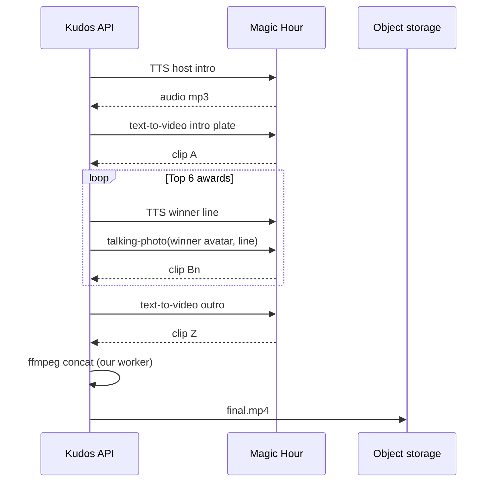

# 04 — Ceremony generation

How **Kudos AI** turns award results into a shareable **9:16** ceremony video via [Magic Hour](https://docs.magichour.ai/integration/overview).

---

## Goals (demo MVP)

| Goal | Target |
|------|--------|
| Length | **60–90s** total |
| Format | **9:16**, 720p (480p fallback on free tier limits) |
| Feel | Awards show: host beats + winner moments |
| Cost control | Cap clips; cache TTS; reuse intro/outro |
| Reliability | Webhook + poll; static fallback if render fails |

---

## Magic Hour primitives we use

| API | Role | Docs |
|-----|------|------|
| `POST /v1/text-to-video` | B-roll, stage, confetti, generic host wide shots | [text-to-video](https://docs.magichour.ai/api-reference/video-projects/text-to-video) |
| `POST /v1/ai-talking-photo` | Winner “acceptance” clip from avatar + audio | [ai-talking-photo](https://docs.magichour.ai/api-reference/video-projects/ai-talking-photo) |
| `POST /v1/ai-voice-generator` | Host narration + winner lines (TTS) | Audio projects |
| `GET /v1/video-projects/:id` | Poll status + `downloads[]` | Async pattern |
| Webhooks | Production completion signal | [integration guide](https://docs.magichour.ai/integration/adding-api-to-your-app) |

**Async contract:** create → `id` + `credits_charged` estimate → poll/webhook → download URLs (**expire in 24h**—re-host on our storage immediately).

**Inputs:** image/audio via HTTPS URL or Magic Hour upload URLs API.

---

## Scene structure



### Beat sheet (example 75s)

| # | Duration | Visual | Audio |
|---|----------|--------|-------|
| 1 | 8s | Text-to-video: “golden stage, spotlights, KUDOS AI” | Host: “Welcome to the 2025 Apartment 4B Kudos…” |
| 2 | 6s × 6 | Talking photo per winner (rotate **6** headline awards) | “And the Human Notification goes to… Alex!” |
| 3 | 8s | Montage card (static ffmpeg): rapid fire other 12 winners as text | Host: “Speed round kudos…” |
| 4 | 7s | Text-to-video: confetti outro | “Post this in the chat. You earned it.” |

**Award selection for video:** Always include user-visible “headline” six: `most_messages`, `funniest`, `ghost`, `late_night_texter`, `drama_starter`, `heart_of_group` (or dynamic if data missing).

**Roast dial affects TTS script only** (templates), not Magic Hour safety filters.

---

## Per-person assets

| Asset | Source |
|-------|--------|
| `image_file_path` | User avatar upload → S3/R2 presigned URL |
| `audio_file_path` | TTS output per line (host or winner voice style) |
| `end_seconds - start_seconds` | 4–6s per talking-photo clip |

**Talking photo settings:**

```json
{
  "start_seconds": 0,
  "end_seconds": 5,
  "assets": {
    "image_file_path": "https://cdn.kudos.ai/sessions/abc/m_alex.png",
    "audio_file_path": "https://cdn.kudos.ai/sessions/abc/line_03.mp3"
  },
  "style": { "generation_mode": "realistic" },
  "max_resolution": 720
}
```

**Missing avatar:** use generated **initials card** image (our canvas) as talking-photo input.

---

## Text-to-video prompts (templates)

Stored as versioned strings; inject `group_name`, `roast_level`.

**Intro (example):**

> Vertical awards stage, warm gold lighting, empty podium, cinematic, no readable text, no celebrity faces, 9:16

**Outro:**

> Confetti falling on awards stage, celebratory, soft focus, 9:16

**Model choice (assumption):** `kling-3.0` or `seedance-2.0-mini` for cost/latency on demo; pin after A/B.

| Parameter | Value |
|-----------|-------|
| `aspect_ratio` | `9:16` |
| `end_seconds` | 5–8 |
| `resolution` | `720p` |

---

## Job orchestration

### States

```
pending → tts_batch → mh_clips_running → concatenating → uploading → complete | failed
```

| Job type | Parallelism |
|----------|-------------|
| TTS lines | 10 concurrent |
| MH video jobs | 3 concurrent (demo cap) |
| Concat | 1 per ceremony |

### Webhook handler

1. Verify Magic Hour signature (when configured).
2. Map `project_id` → internal `CeremonyJob`.
3. On `complete`: fetch downloads immediately; store to our bucket.
4. On `failed`: increment retry; switch to fallback after 2 retries.

### Retry policy

| Error | Action |
|-------|--------|
| `insufficient_credits` | Alert ops; queue paused; user sees “try later” |
| `invalid_request` | Log prompt/assets; skip clip; substitute static card |
| `internal_server_error` | Exponential backoff ×3 |
| Timeout 15 min | Fail job → fallback |

---

## Concatenation

Magic Hour does not expose a single “merge these project IDs” in basic docs—**our worker** uses **ffmpeg** `concat demuxer` on downloaded MP4s.

Order file:

```
file 'intro.mp4'
file 'award_01.mp4'
...
file 'outro.mp4'
```

Normalize: 9:16, 30fps, AAC audio before concat.

---

## Cost & latency (estimates)

**Per ceremony (6 talking photos + 2 text-to-video + TTS):**

| Item | Estimate |
|------|----------|
| Magic Hour credits | **~3,000–8,000** credits total (model-dependent; log `credits_charged` per job) |
| Wall clock | **4–12 min** (parallel clips) |
| Jev | Already sunk in analysis (~$0.01) |
| Storage | <50 MB per final MP4 |

**Demo guardrails:** global max **N ceremonies/day**; per-IP limits in [02](./02-user-flows.md).

---

## Fallback if generation fails

| Tier | User sees |
|------|-----------|
| **Partial** | Video with static images for failed talking-photo clips |
| **Full fail** | **Slideshow MP4** (ffmpeg + Ken Burns on award cards) + same share URL |
| **Catastrophic** | Interactive **awards page only** + downloadable PNG carousel; email ops |

Copy: “The stage lights glitched—we still have your kudos.”

---

## Delivery

| Output | TTL |
|--------|-----|
| `final.mp4` on our CDN | **7 days** (demo) |
| Share page | **30 days** session TTL |
| Magic Hour source downloads | Fetch within 24h; not user-facing |

---

## Content moderation (generated video)

- Pre-check TTS script against blocklist (slurs, PII patterns).
- Magic Hour provider filters apply; we do not request violent/sexual prompts.
- User report button on share page → hide slug pending review.

---

## Assumptions & open questions

| # | Item |
|---|------|
| 1 | **Assumption:** ffmpeg concat in our worker is acceptable for demo vs Magic Hour `ai-video-editor` (evaluate in build). |
| 2 | **Assumption:** One host voice for all TTS at MVP. |
| 3 | **Open:** Include background music (licensed stock) or voice-only. |
| 4 | **Open:** Magic Hour plan tier for 720p on free demo volume. |
