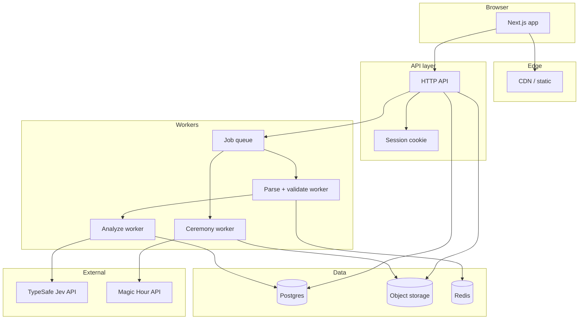

# 05 — Architecture

System design for **Kudos AI** demo MVP: web app, JSON ingest, analysis, Jev, Magic Hour jobs, storage.

---

## High-level diagram



---

## Recommended stack

| Layer | Choice | Why |
|-------|--------|-----|
| **Frontend** | **Next.js 15** (App Router) + React | Fast MVP, OG images, API routes colocated |
| **UI** | Tailwind + shadcn/ui | Skimmable demo polish |
| **API** | Next.js Route Handlers or **Hono** in `apps/api` | Typed routes; split later if needed |
| **DB** | **Postgres** (Neon / Supabase) | Sessions, jobs, awards JSON |
| **Queue** | **BullMQ** + Redis (Upstash) | Analyze + ceremony pipelines |
| **Object storage** | **Cloudflare R2** or S3 | Avatars, TTS mp3, final MP4 |
| **Worker runtime** | Node 22 separate process or **Trigger.dev** / Inngest | Long Magic Hour polls |
| **Video concat** | ffmpeg in worker container | Clip assembly |
| **Observability** | Axiom / Sentry | Job failures, parse rejects |

**Monorepo:** `pnpm` workspaces — `apps/web`, `apps/worker`, `packages/chat-json`, `packages/awards`.

---

## Service responsibilities

### Web app

- Landing, export guides, upload UI, mapping, roast dial, preview, player.
- Signed upload URLs for avatars (direct to R2).
- Poll `GET /api/sessions/:id/status` or SSE for job progress.

### API

| Concern | Owner |
|---------|--------|
| Session CRUD | API + Postgres |
| JSON upload | API streams to worker or parses inline if <5MB |
| Validation | `packages/chat-json` |
| Analysis orchestration | Enqueue `analyze` job |
| Ceremony orchestration | Enqueue `ceremony` job |
| Webhooks | `POST /api/webhooks/magic-hour` |

### Parse pipeline

```
bytes → JSON.parse (safe) → adapter → CanonicalChat → Message[]
```

- No `eval`, no dynamic `require`.
- Persist **only** normalized summary + features to DB, not raw file (see [06](./06-data-and-privacy.md)).

### Analyze worker

1. Build feature store (full scan).
2. Assign deterministic awards.
3. Build Jev state; call TypeSafe `v1/systemone` in 1–3 batches.
4. Apply max-4-awards rule; template copy with roast level.
5. Write `Analysis` record.

### Ceremony worker

1. Load analysis + avatars.
2. TTS batch → Magic Hour clips → download → ffmpeg → upload final.
3. Update `Ceremony` with `videoUrl`.

---

## Jev integration

```typescript
// packages/awards/jev-client.ts
const res = await fetch("https://api.typesafe.ai/v1/systemone", {
  method: "POST",
  headers: {
    Authorization: `Bearer ${process.env.TYPESAFE_API_KEY}`,
    "Content-Type": "application/json",
  },
  body: JSON.stringify({
    model: "jev-1.13.0",
    state: compactState,
    questions: awardQuestions,
  }),
});
```

- Retry `max_tokens_exceeded` with slimmer state.
- Log `usage.input_tokens` per session for cost dashboard.

---

## Magic Hour integration

- `create()` + webhook (not blocking `generate()` in API thread).
- Store `mh_project_id` per clip on `CeremonyClip` rows.
- On complete: copy MP4 to R2 within minutes of MH expiry window.

---

## Security architecture

| Layer | Control |
|-------|---------|
| Upload | Size, depth, rate limits ([02](./02-user-flows.md)) |
| API | CSRF on cookie sessions; CORS locked to app origin |
| Secrets | `TYPESAFE_API_KEY`, `MAGIC_HOUR_API_KEY` server-only |
| Share URLs | Unguessable `slug` (128-bit); `noindex` |
| PII in logs | Redact message bodies; log counts only |

---

## Deployment (demo)

| Component | Host |
|-----------|------|
| Web | Vercel |
| Worker + ffmpeg | Fly.io / Railway Docker |
| Postgres | Neon |
| Redis | Upstash |
| R2 | Cloudflare |

Single region OK for demo; ceremony worker needs ffmpeg image (~500MB).

---

## Assumptions & open questions

| # | Item |
|---|------|
| 1 | **Assumption:** Colocated Next API for demo; split `apps/api` when worker CPU conflicts with serverless limits. |
| 2 | **Assumption:** Postgres JSONB for `analysis.awards` blob. |
| 3 | **Open:** Run analyze synchronously for <5k messages to skip queue complexity in week-1 prototype. |
