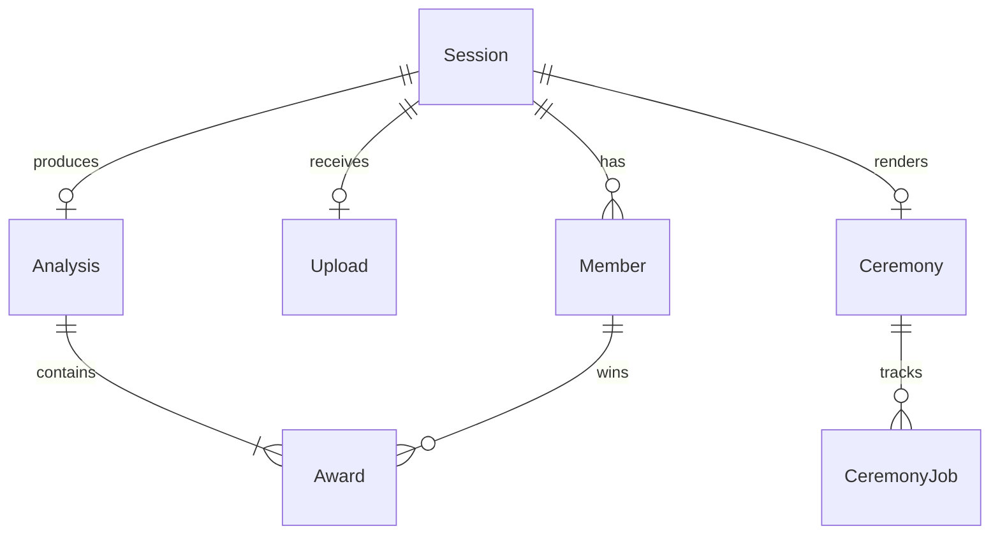

# 07 — API & data model

Core entities and HTTP API for **Kudos AI** demo MVP.

**Base URL (assumption):** `https://api.kudos.ai/v1` (or same-origin `/api` on Vercel).

---

## Entities



### Session

| Field | Type | Notes |
|-------|------|-------|
| `id` | uuid | |
| `slug` | string | Public share id |
| `status` | enum | `created`, `uploaded`, `mapping`, `analyzing`, `preview`, `rendering`, `complete`, `failed` |
| `roastLevel` | enum | `gentle`, `medium`, `spicy` |
| `groupTitle` | string? | From JSON or user |
| `consentAt` | timestamp? | |
| `expiresAt` | timestamp | |
| `createdAt` | timestamp | |

### Member

| Field | Type |
|-------|------|
| `id` | uuid |
| `sessionId` | uuid |
| `exportKey` | string |
| `displayName` | string |
| `avatarObjectKey` | string? |
| `messageCount` | int |
| `excluded` | boolean |

### Upload

| Field | Type |
|-------|------|
| `id` | uuid |
| `sessionId` | uuid |
| `formatDetected` | enum |
| `byteSize` | int |
| `messageCount` | int |
| `memberCount` | int |
| `parsedAt` | timestamp |
| `validationWarnings` | string[] |

### Analysis

| Field | Type |
|-------|------|
| `id` | uuid |
| `sessionId` | uuid |
| `featureVersion` | string |
| `jevModel` | string |
| `inputTokens` | int |
| `completedAt` | timestamp |

### Award

| Field | Type |
|-------|------|
| `id` | uuid |
| `analysisId` | uuid |
| `awardId` | string |
| `winnerMemberId` | uuid |
| `runnerUpMemberId` | uuid? |
| `source` | `code` \| `jev` |
| `receipts` | json |
| `presentationLine` | string |
| `jevConfidence` | float? |

### Ceremony

| Field | Type |
|-------|------|
| `id` | uuid |
| `sessionId` | uuid |
| `status` | enum |
| `videoObjectKey` | string? |
| `durationSec` | float? |
| `fallbackUsed` | boolean |
| `mhCreditsTotal` | int? |

### CeremonyJob

| Field | Type |
|-------|------|
| `id` | uuid |
| `ceremonyId` | uuid |
| `type` | enum |
| `externalId` | string? |
| `status` | enum |
| `attempt` | int |

---

## Kudos Chat JSON v1

Canonical format for any source after adapter normalization.

```json
{
  "kudos_version": "1",
  "chat": {
    "title": "Apartment 4B",
    "platform": "telegram",
    "exported_at": "2025-09-30T12:00:00Z"
  },
  "members": [
    { "id": "user123", "display_name": "Alex" },
    { "id": "user456", "display_name": "Sam" }
  ],
  "messages": [
    {
      "id": "m1",
      "ts": "2024-11-02T01:14:00Z",
      "author_id": "user123",
      "text": "bro nobody asked for a TED talk",
      "type": "message",
      "reactions": [{ "emoji": "😂", "count": 2 }]
    }
  ]
}
```

| Field | Required | Rules |
|-------|----------|-------|
| `kudos_version` | Yes | `"1"` |
| `messages[].id` | Yes | Unique string |
| `messages[].ts` | Yes | ISO 8601 UTC |
| `messages[].author_id` | Yes | Must exist in `members` or auto-create |
| `messages[].text` | No | Default `""`; max 10k chars |
| `members` | No | Inferred from authors if omitted |

**Adapter output** always converts to this shape in memory before DB write.

---

## Endpoints

### `POST /sessions`

Create demo session.

**Response**

```json
{ "sessionId": "550e8400-e29b-41d4-a716-446655440000", "uploadUrl": "/api/sessions/550e.../upload" }
```

### `POST /sessions/:id/upload`

`multipart/form-data` field `file` (.json) **or** raw `application/json` body.

**Response 200**

```json
{
  "formatDetected": "telegram",
  "messageCount": 28410,
  "memberCount": 6,
  "members": [
    { "id": "m1", "displayName": "Alex", "messageCount": 4812 }
  ],
  "warnings": ["truncated 3 messages over 10k chars"]
}
```

**Response 400**

```json
{
  "code": "MALICIOUS_CONTENT",
  "message": "This file failed safety checks."
}
```

### `PATCH /sessions/:id`

```json
{
  "roastLevel": "spicy",
  "groupTitle": "Apartment 4B",
  "members": [
    { "id": "m1", "displayName": "Alex", "excluded": false }
  ],
  "consent": true
}
```

### `POST /sessions/:id/analyze`

Enqueue analysis. Idempotent if already complete.

**Response 202**

```json
{ "status": "analyzing", "jobId": "..." }
```

### `GET /sessions/:id`

```json
{
  "status": "preview",
  "roastLevel": "medium",
  "groupTitle": "Apartment 4B",
  "members": [...],
  "analysis": {
    "awards": [
      {
        "awardId": "most_messages",
        "title": "The Human Notification",
        "winner": { "memberId": "m1", "displayName": "Alex" },
        "presentationLine": "...",
        "receipts": ["4,812 messages (34%)"]
      }
    ]
  },
  "ceremony": null
}
```

### `POST /sessions/:id/ceremony`

Start Magic Hour pipeline.

**Response 202**

```json
{ "ceremonyId": "...", "status": "rendering" }
```

### `GET /sessions/:id/status`

Lightweight poll.

```json
{
  "status": "rendering",
  "progress": 0.45,
  "stage": "mh_clips_running"
}
```

### `GET /s/:slug`

Public share page (HTML) or `Accept: application/json` for embed.

```json
{
  "groupTitle": "Apartment 4B",
  "awards": [...],
  "videoUrl": "https://cdn.kudos.ai/.../final.mp4",
  "watermark": "Kudos AI"
}
```

### `POST /webhooks/magic-hour`

Provider callback → update `CeremonyJob`.

### `DELETE /sessions/:id`

User-initiated delete all artifacts.

---

## Internal types (TypeScript)

```typescript
type RoastLevel = "gentle" | "medium" | "spicy";

type CanonicalMessage = {
  id: string;
  ts: string;
  authorId: string;
  text: string;
  type: "message" | "system";
  reactions?: { emoji: string; count: number }[];
  replyToId?: string;
};

type AwardResult = {
  awardId: string;
  title: string;
  winnerMemberId: string;
  runnerUpMemberId?: string;
  source: "code" | "jev";
  receipts: string[];
  presentationLine: string;
  jev?: { questionId: string; confidence: number };
};
```

---

## Assumptions & open questions

| # | Item |
|---|------|
| 1 | **Assumption:** Cookie session binds to `sessionId`; no JWT for demo. |
| 2 | **Assumption:** `GET /s/:slug` does not require auth; security = secret slug. |
| 3 | **Open:** API versioning prefix before public partners. |
